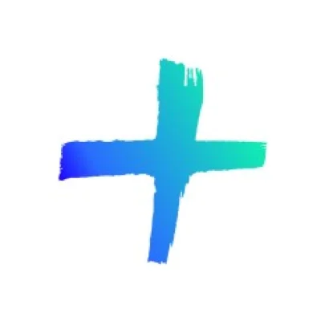

# Cómo editar este sitio

Todo el contenido vive en dos archivos: `index.html` (Works) y `about.html` (Story).
Son texto plano: buscas la frase, la cambias, guardas y recargas el navegador.
No hay que compilar nada.

Para verlo mientras editas, abre la Terminal en esta carpeta y corre:

```
python3 -m http.server 8743
```

Luego entra a `localhost:8743`. Cada vez que guardes, recarga la página.

> **Si guardas un cambio y no lo ves:** el navegador cachea `style.css`.
> Recarga forzando la caché con **Cmd+Shift+R**. Pasa sobre todo al tocar
> colores, fondos o medidas: el archivo está bien pero ves la versión vieja.

---

## Lo mínimo que hay que cambiar antes de publicar

Ahora mismo el sitio tiene el contenido del portfolio de referencia. **Todo esto
tiene que ser tuyo antes de que salga a internet**, tanto por autoría como porque
las imágenes están enlazadas a un servidor ajeno y pueden desaparecer sin aviso.

- [ ] El nombre del logo (arriba a la izquierda, en las dos páginas)
- [ ] El `<title>` de cada página (lo que se ve en la pestaña y en Google)
- [ ] Los titulares y textos de las dos páginas
- [ ] Las 7 imágenes de casos + sus etiquetas
- [ ] Los 4 iconos de servicios
- [ ] Tu retrato en Sobre mí (`img/leandro.webp`)
- [ ] La biografía de Sobre mí: hoy es un esqueleto, falta tu historia
- [x] Los 4 logos del historial (ver *Logos del historial*, más abajo)
- [ ] El correo del footer — está en dos sitios: el texto visible y el
      `data-email` del botón (que es lo que se copia al pulsarlo)
- [ ] Los enlaces de redes (hoy están en `#`, sin destino)
- [ ] El botón "Download my CV" de Story (hoy en `#`): apúntalo a tu PDF
- [ ] Las 2 imágenes de resplandor del fondo (ver *Fondo*, más abajo)

---

## Cambiar un texto

Busca la frase tal cual aparece en pantalla y reemplázala. Ejemplo, el titular:

```html
<h1 data-reveal>Hey! I'm Daniel Sun, a designer who brings...</h1>
```

**Ojo con los titulares grandes:** están calibrados para cortar en palabras
concretas. Si pones un texto más largo o más corto, el corte cambia. Si no te
gusta cómo queda, se ajusta el ancho en `style.css` buscando `.hero h1`
(o `.section-title`) y cambiando su `max-width`.

## Cambiar una imagen

Todas las imágenes del sitio están en **WebP**, que pesa un tercio que un PNG
y se ve igual. Exporta como siempre desde Figma y convierte el archivo:

```
cwebp -q 85 mi-captura.png -o img/mi-caso.webp
```

Luego sustituye la ruta en el HTML. **Los atributos `width` y `height` son
obligatorios** y llevan las medidas reales del archivo: son los que reservan el
hueco para que el texto no baje de golpe cuando la imagen termina de cargar.
Para saberlas: `sips -g pixelWidth -g pixelHeight img/mi-caso.webp`.

```html

```

`loading="lazy"` va en todas menos en la primera imagen de cada página, que es
la única que se ve nada más entrar y por eso carga de inmediato.

El `alt` es la descripción para lectores de pantalla y buscadores: escribe qué
es el proyecto, no dejes "imagen".

**Proporciones**, para que no se deformen:
- Caso ancho: 1168 × 658 (aprox. 16:9)
- Caso a media columna: 580 × 659 (casi cuadrado, un poco vertical)
- Iconos de servicio: 80 × 80
- Retrato de Sobre mí: vertical 4:5

**Exporta al doble**: el sitio se ve a 1168px de ancho, así que las capturas
van a 2336px para que no se vean borrosas en pantallas Retina.

## Añadir o quitar un caso

Cada caso es un bloque `<a class="work-card">`. Para quitarlo, borras el bloque
entero. Para añadir uno, copias uno existente y le cambias imagen y etiquetas.

- `class="work-card"` → ocupa el ancho completo
- `class="work-card half"` → ocupa media columna (van de dos en dos)

Las etiquetas de arriba son los `<span class="tag">`. La primera lleva
`class="tag primary"` (fondo blanco) y es el nombre del cliente.

## Crear la página de un caso

`enovus.html` es la plantilla. Para el siguiente caso:

1. Duplica el archivo con el nombre del proyecto (`abastible.html`, por ejemplo).
2. Cambia el `<title>`, el titular, la entradilla, las fichas y los textos.
3. Cambia las cuatro imágenes.
4. En `index.html`, pon ese nombre de archivo en el `href` de su tarjeta:
   `<a class="work-card" href="abastible.html">`.

La estructura se repite: portada, imagen, resumen en dos columnas, y luego
bloques de texto alternados con imágenes.

### Encuadre de la imagen de la tarjeta

La tarjeta es más apaisada que las imágenes del caso, así que recorta por
arriba y por abajo. Por defecto recorta centrado, que suele ser lo correcto.

Si una imagen queda mal encuadrada (algo importante cortado), añade esto al
`` de esa tarjeta:

```html

```

El segundo número elige qué franja se ve: `0%` es el borde de arriba, `100%`
el de abajo, `50%` el centro. Baja el número para salvar la parte de arriba,
súbelo para salvar la de abajo.

En móvil no hace falta tocar nada: ahí la tarjeta cambia de proporción y la
imagen se ve completa.

## Logos del historial

Los cuatro puestos de "Dónde he trabajado" (portada) y del historial de Story
llevan el logo de la empresa en un círculo de 40x40. **Los dos archivos tienen
que ir iguales:** si cambias uno, cambia el otro.

```html

```

El `alt` va vacío a propósito: el nombre de la empresa está escrito al lado, así
que un lector de pantalla lo diría dos veces.

| Empresa | Archivo |
| --- | --- |
| Enovus+ | `img/enovus.webp` |
| Abastible | `img/abastible.webp` |
| HF Solutions | `img/hf-solutions.webp` |
| eClass | `img/eclass.webp` |

En `img/logos-originales/` están los archivos tal como llegaron, sin tocar. Los
de `img/` son la versión preparada para el círculo: Abastible venía con el
logo completo (símbolo naranja + la palabra "abastible") y a 40px la palabra no
se leía, así que quedó sólo el símbolo; a HF Solutions y Enovus+ se les igualó
el margen para que las cuatro marcas pesen lo mismo. Si algún día usas estos
logos en grande, tira de `logos-originales/`: ahí Abastible conserva la palabra.

**Si sustituyes un logo**, lo que mejor funciona en un círculo de 40px:

- Imagen cuadrada, de 200px de lado o más.
- El símbolo solo (sin el nombre de la empresa), centrado y ocupando unos dos
  tercios del cuadrado. Si llega hasta el borde, el círculo le corta las puntas.
- Fondo blanco o de color, pleno. Con transparencia también funciona, pero en la
  página oscura la marca queda flotando sin ficha y desentona con las otras.

El filete gris del borde es lo que hace que los logos sobre blanco se lean como
fichas en la página clara. Está en `style.css`, en `.timeline-row img`: para
quitarlo, borra la línea del `border`.

## Cambiar colores y tipografía

Están todos juntos al inicio de `style.css`, en los bloques
`body.theme-light` y `body.theme-dark`. Cambiando ahí se actualiza todo el sitio.

Las tipografías están en la carpeta `fonts/` y se declaran al principio de
`style.css`. Antes se cargaban desde Google Fonts; ahora las sirve tu propio
sitio, que carga antes y evita que Google reciba la IP de cada visitante. Las
variables `--serif`, `--sans` y `--garamond` definen dónde se usa cada una.

Si cambias de tipografía, hay que tocar tres sitios: los bloques `@font-face`
al principio de `style.css`, las variables de familia, y las dos líneas
`<link rel="preload">` del `<head>` de cada página.

### Los dos tipos de botón

- **Sólido**, al revés que la página: negro en las páginas claras, blanco en
  Story. Son "Trabajemos juntos" (`.btn-pill`) y "Descargar mi CV" (`.cv-btn`).
  El color sale de `--fg` y `--bg`, así que se dan vuelta solos según la página;
  el color al pasar el ratón es `--btn-solid-hover`.
- **Gris neutro**, para lo secundario: el "Todos los proyectos" de las páginas
  de caso (`.cv-btn.back-link`). Usa `--btn-bg` y `--btn-bg-hover`.

Si quieres que un botón sólido vuelva a ser gris, cámbiale `background` a
`var(--btn-bg)` y `color` a `var(--fg)`.

## Fondo

La retícula fina es un patrón SVG escrito dentro de `style.css`
(variable `--grid-tile`). Para quitarla, borra la regla `body::before`.
Para hacerla más o menos visible, cambia `--grid-opacity`
(hoy: 6% en la página clara, 12% en la oscura).

El hero no lleva resplandor: es fondo plano más la retícula.

## Archivos que no se ven pero importan

| Archivo | Para qué sirve | Cuándo tocarlo |
| --- | --- | --- |
| `sitemap.xml` | La lista de páginas para Google | Al añadir o quitar una página |
| `robots.txt` | Permite el rastreo y apunta al sitemap | Casi nunca |
| `404.html` | Lo que ve quien llega a una dirección que no existe | Casi nunca |
| `img/og-card.png` | La tarjeta que sale al pegar el enlace en LinkedIn o WhatsApp | Si cambias de titular o de oficio |
| `fonts/` | Las tipografías, servidas desde aquí y no desde Google | Solo si cambias de tipografía |

La tarjeta de compartir mide **1200 × 630**, que es lo que recortan las redes.
Va en PNG a propósito y no en WebP: el rastreador de LinkedIn no maneja WebP con
fiabilidad, y ahí es donde más se va a compartir. Si la rehaces en Figma,
exporta a esa medida exacta y conserva el nombre del archivo.

### Si algún día pones dominio propio

Hay que cambiar el dominio en tres sitios: el `<link rel="canonical">` y las
etiquetas `og:` del `<head>` de las seis páginas, y las seis direcciones de
`sitemap.xml`. Busca `leandropov.github.io` y reemplaza.

---

## Si algo se rompe

Lo más común es borrar un `<div>` de cierre de más y que el layout se desarme.
Si pasa, deshaz con `Cmd+Z` y vuelve a intentar. Y si te trabas, me pasas el
archivo y lo arreglo.
